# 2025年十四大最佳客户门户平台

客户项目管理最头疼的就是信息分散,邮件、微信、Slack、共享文档各种工具切来切去,找个文件要翻半天聊天记录。传统方式效率低不说,客户体验也差,总觉得你们团队不够专业。现在有了专门的客户门户平台,把文档共享、任务追踪、审批流程、安全通信都集中到一个品牌化的门户里。客户登录自己的专属空间就能看到项目进展、上传文件、电子签名,你这边也能自动化工作流程减少手动操作。从自由职业者到大型企业,各种规模和行业都能找到合适的解决方案,关键是选对工具能让你的服务交付效率提升好几倍,客户满意度也会明显改善。

***

## **[Moxo](https://www.moxo.com)**

企业级服务编排的白标门户

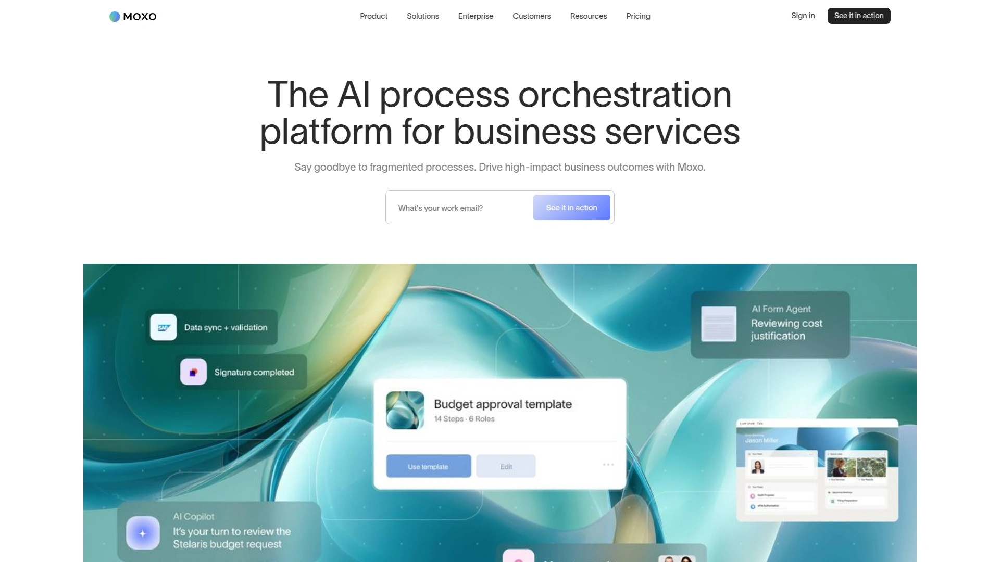

Moxo由WebEx联合创始人开发,专注于编排多方参与的复杂业务流程。平台提供基于角色的客户门户、工作流自动化和协作工具,帮助企业标准化服务交付。核心功能包括可视化工作流构建器,支持审批、确认、文件请求和任务管理,高级套餐解锁条件逻辑、表单分支和智能警报。

互动套件整合了安全消息传递、视频会议、文件共享带批注和电子签名,所有互动在一个环境内完成。Magic链接让客户无需密码即可访问门户,管理员从中央门户配置权限和工作流。进度追踪器提供任务和工作流状态的可视化视图,客户和员工共享进度信息。审计跟踪在高级套餐保留长达7年记录,确保合规性和透明度。

Business Pro和Enterprise套餐包含管理报告仪表板,分析工作流效率和监控服务表现。高级套餐支持数据同步、自定义API集成、SDK和webhook实现完全扩展性。服务花旗银行、FIS、法国巴黎银行等金融机构,证明了平台在高安全要求场景的可靠性。特别适合需要处理多部门协调、监管合规严格的金融、法律、咨询和医疗机构。

***

## **[Clinked](https://www.clinked.com)**

安全协作的完全定制方案

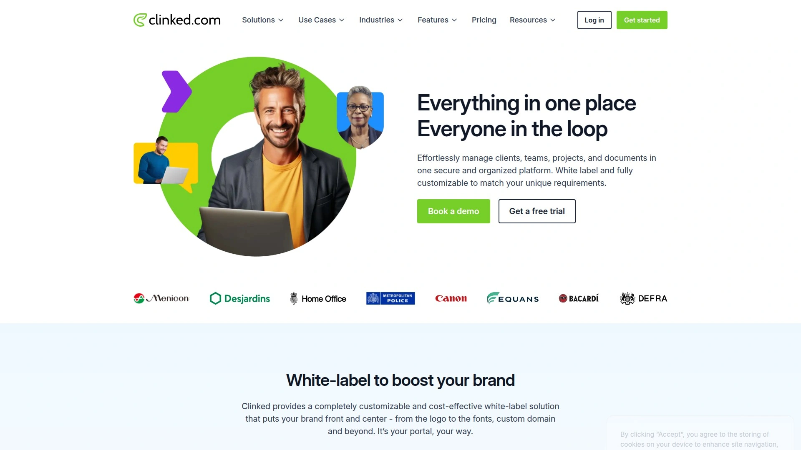

Clinked提供两种客户门户解决方案:使用模板创建白标门户或由Clinked从头定制构建。平台功能远超竞争对手,包括文档编辑器、评论、批注、共享日历和内部群聊工具类似Slack。Standard套餐及以上提供看板任务板,直接在Clinked内处理项目管理。

支持组或个人级别的用户访问控制,安全共享文件。提供iOS和Android移动应用,随时随地管理客户通信和文档。银行级安全标准保护敏感客户信息。白标能力强,完全移除Clinked品牌。

Lite套餐每月119美元起,虽然价格偏高但功能全面。通过Zapier集成数千个应用,自动化工作流如从Jotform提交创建Clinked群组或为新Zoom会议创建事件。特别适合需要高度定制、重视安全性和品牌一致性的代理公司和企业。

***

## **[SuiteDash](https://suitedash.com)**

一体化业务管理中枢

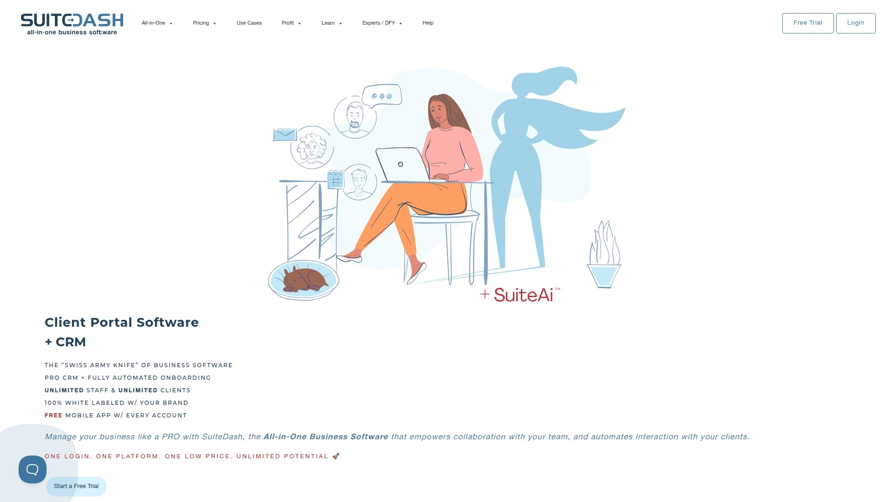

SuiteDash不只是客户门户,而是集CRM、项目管理、开票、合同、文档存储于一体的全功能平台。白标客户门户安全且可定制,客户登录后访问项目、发票、合同和文件。内置时间追踪、任务管理、发票开具和支付处理简化运营。

表单构建器和自动化工作流减少手动操作。文件共享和协作工具保持团队同步。集成日历和日程安排功能方便预约。完全品牌化包括自定义域名、logo和配色方案。

月费从19美元起,性价比在全功能平台中很有竞争力。适合需要不只是门户而是完整业务管理系统的小型企业和自由职业者。

***

## **[Copilot](https://www.copilothq.com)**

移动优先的轻量级选择

Copilot界面现代简洁,特别适合远程工作的小型服务企业和创业公司。提供iOS和Android移动应用,客户可以在手机上查找信息、通信或追踪项目进展。核心功能包括安全消息传递、开票、文件共享、合同管理和表单。

Copilot AI帮助起草、改写和总结内容。集成Airtable、Google Sheets、ClickUp和Calendly等内部工具和支付处理器。可以为基础任务设置自动化,如欢迎消息、intake表单和会议链接。

月费从39美元起(按年付),提供14天免费试用。定制选项有限,不适合需要完全白标品牌或强合规性的大型团队。特别适合自由职业者和小型创业公司,优先考虑易用性和快速上手。

---

## **[HoneyBook](https://www.honeybook.com)**

创意服务行业的专属管家

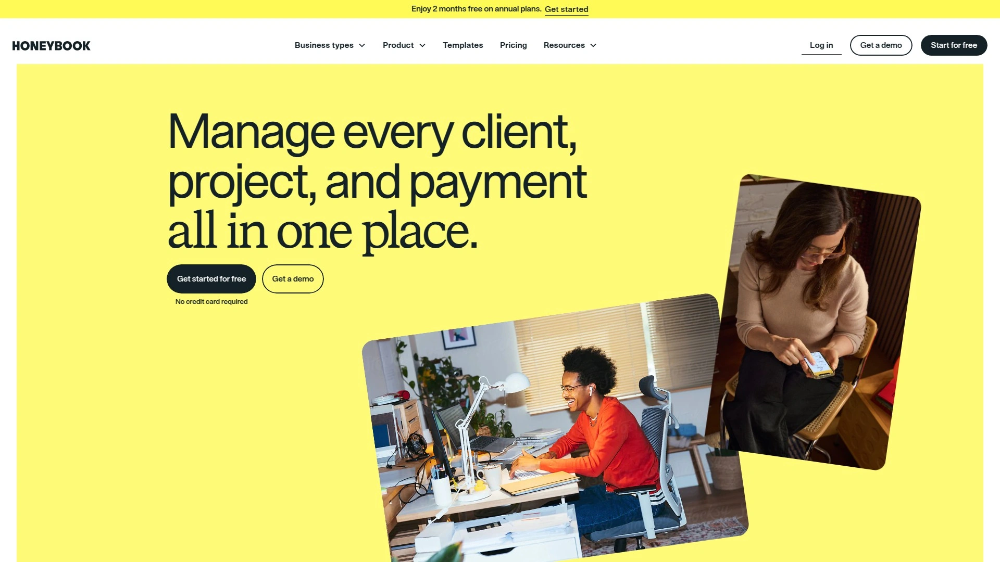

HoneyBook专为创意和服务行业设计,帮助管理从潜在客户到项目交付的完整客户流程。互动式客户门户让客户只需几次点击即可访问沟通记录和文档。邮件与HoneyBook同步,在一个地方查看所有客户通信。

时间追踪功能直接从应用追踪计费和非计费时长,从追踪时间直接创建发票。任务管理可以为自己和团队成员创建任务、自动化提醒,在一个地方查看所有任务。可定制的项目流程和模板库加速重复流程。

通过Zapier集成Asana、ClickUp、Notion等项目管理软件。定价从月付开始,适合摄影师、设计师、活动策划等创意专业人士。

---

## **[Dubsado](https://www.dubsado.com)**

自动化工作流的定制专家

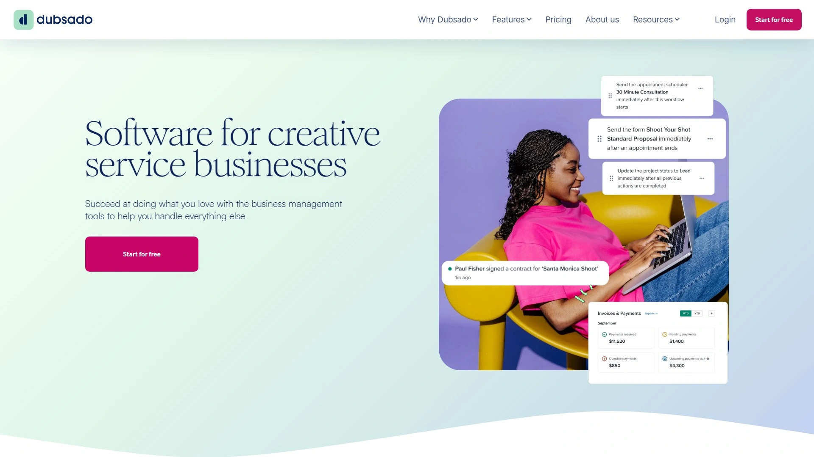

Dubsado定位为CRM和客户管理系统(CMS)的混合体,提供高级工作流自动化能力。可定制表单、开票、自动化选项和互动客户门户。客户门户提供详细的互动历史和广泛的定制化。

自动化功能允许业务自动化重复任务并保持无缝的客户管理体验。合同和提案模板加快文档创建。工作流构建器创建触发式自动化序列。定制品牌体验包括个性化电子邮件、表单和合同。

月费从20美元起,提供免费试用。比HoneyBook更适合需要深度定制和复杂自动化的用户,但学习曲线稍陡。特别适合想要完全掌控客户体验自动化的创意专业人士。

---

## **[Zendesk](https://www.zendesk.com)**

客户服务巨头的门户扩展

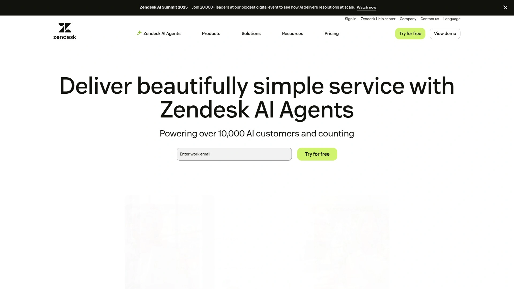

Zendesk是全球知名的客户服务平台,客户门户作为支持系统的延伸。允许客户轻松追踪支持票据状态和访问过往互动。AI驱动的客户服务能力是其核心优势。帮助中心功能让企业构建知识库和自助资源。

全面的票据管理系统、多渠道支持和详细分析适合企业级需求。每代理每月55美元起按年付费,14天免费试用。定价按代理计费,团队规模大时成本快速增加。

更侧重支持票据而非项目协作,不是最佳的纯项目门户选择。特别适合需要强大帮助台系统并希望添加门户功能的中大型企业。

***

## **[FuseBase](https://thefusebase.com)**

销售和营销团队的协作空间

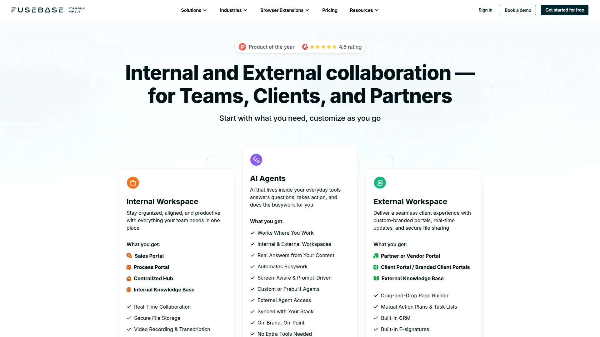

FuseBase(前身Nimbus)提供品牌化可定制的客户门户,整合资源、反馈和信息到一个自助目的地。工作区页面编辑器使用文本、图片、表格、切换等模块构建内容。可编辑页面收集客户输入,只读页面限制编辑。

聊天小部件添加到任何页面实现实时通信。白标能力匹配门户样式到你的品牌,包括自定义域名、logo、颜色和字体,移除FuseBase品牌。Magic链接让客户无需密码即时访问,可选密码保护增强安全。

月费38美元起。特别适合销售和营销团队需要分享提案、收集反馈和管理客户关系的场景。

***

## **[MyDocSafe](https://mydocsafe.com)**

安全入职的合规专家

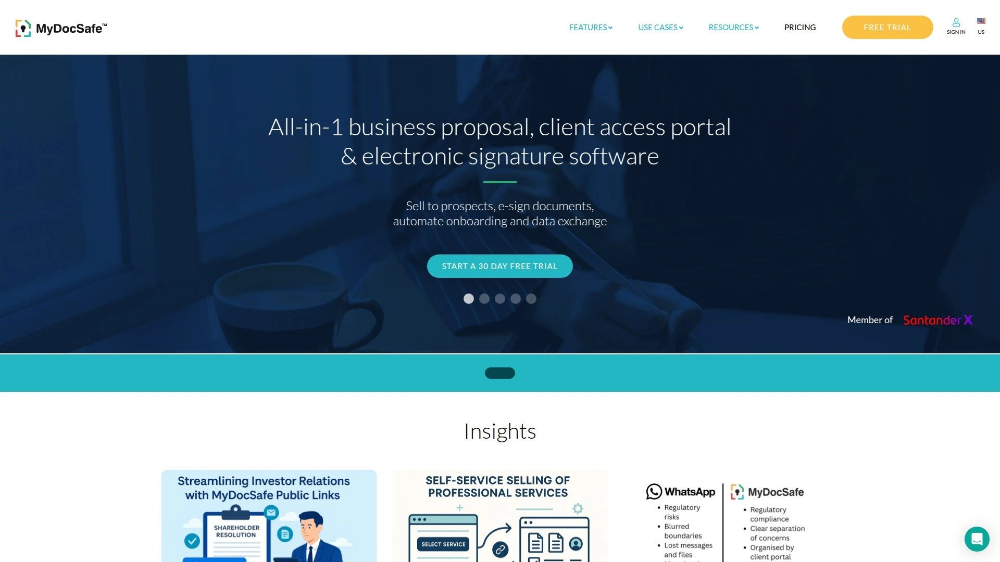

MyDocSafe专注电子签名、安全客户门户和提案平台,用于客户入职和管理。使用金融机构相同的顶级加密标准保护所有敏感文档。自动文档分发、提醒和通知最小化新客户入职的非计费时间。

Prospects功能发送付款请求、报价、商业提案和售前工作流,包括服务选择、表单填写、合同签署。支持荷兰语、法语、德语、意大利语、波兰语、葡萄牙语、西班牙语等多语言界面。CSV批量上传客户信息并自动邀请到独立门户。

每用户每月25美元起按年付费,提供30天免费试用。AML和KYC合规功能特别适合金融和法律行业。适合重视数据安全和监管合规的专业服务机构。

---

## **[Onehub](https://www.onehub.com)**

文件共享为核心的简洁方案

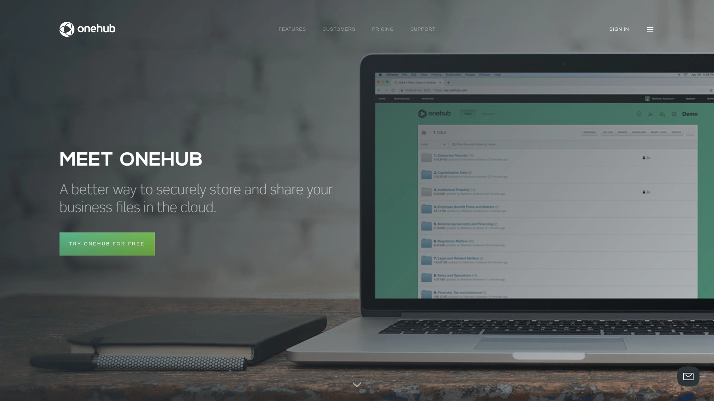

Onehub主打云存储和共享,客户门户可以完全定制品牌颜色和logo。嵌入式登录表单允许员工、客户和业务伙伴从网站页面登录。用户仪表板可定制快速访问链接、欢迎消息和近期活动高亮。

休眠模式功能让暂停合同的客户账户保存信息但降低成本,可随时恢复。集成Google Drive和Microsoft方便基础协作。银行级加密保护文件存储。

Data Room Edition套餐按年付费每月300美元,也提供按用户数定价的小型套餐。学习曲线存在,界面不是最直观。首先设计用于内部文件共享,客户门户功能相对简单。适合需要简单文件共享方案、不需要复杂附加功能的用户。

---

## **[Ahsuite](https://ahsuite.com)**

小型企业的组织助手

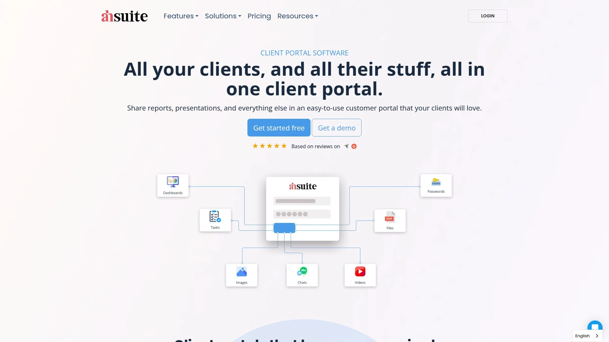

Ahsuite是简单易用的客户门户工具,帮助企业保持组织性。以让协作更顺畅而闻名。界面直观,学习曲线平缓。提供项目管理、文件共享、任务追踪和客户通信基础功能。

定价实惠,适合预算有限的小型企业和自由职业者。功能深度不如企业级平台,但对于基础需求完全够用。特别适合刚开始使用客户门户、不想被复杂功能压垮的小团队。

---

## **[Accelo](https://www.accelo.com)**

专业服务自动化的报价到收款平台

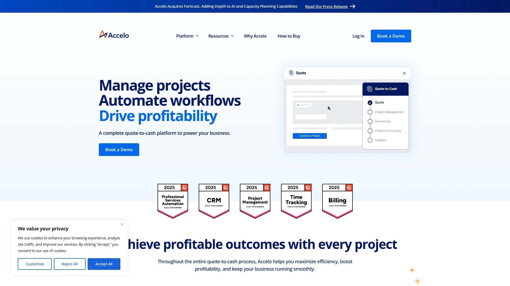

Accelo是完整的专业服务自动化(PSA)软件,管理从报价到收款的整个流程。自动化工作流驱动盈利能力。发票合并功能简化账单流程。时间追踪、资源管理和项目计划一体化。

强大的报告和分析追踪团队表现和项目盈利能力。需要联系获取定价。功能全面但复杂,更适合已经成熟的专业服务公司而非小型创业团队。

***

## **[Kahootz](https://www.kahootz.com)**

公共部门信赖的跨组织协作

Kahootz是安全云协作平台,受英国国防部等组织信任。工作区包含调查、文档管理、论坛、日历等工具。可以处理任意数量的内部和外部用户,适合大型跨组织项目。

结构化文档功能支持多用户文档编辑和利益相关者咨询程序。讨论论坛、评论和反馈的统一场所。灵活按需付费定价,只为实际需要的用户数付费。

Starter套餐每用户每月5.5英镑按年付费,30天免费试用。最低3个月授权期限。特别适合公共部门组织、企业和非营利机构需要安全跨组织协作的场景。

***

## **[Plutio](https://www.plutio.com)**

独立创业者的全能助手

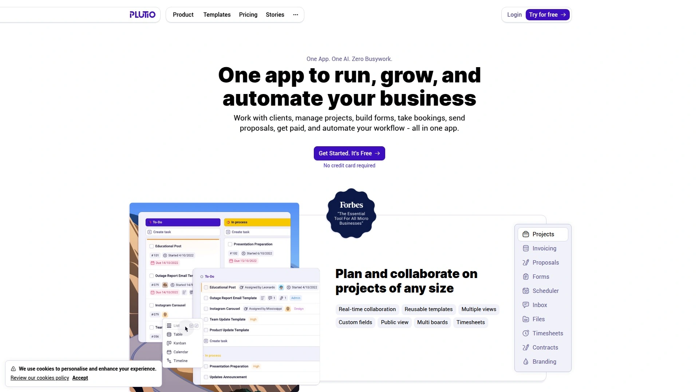

Plutio面向独立创业者和小团队,提供一体化业务管理解决方案。比SuiteDash更简单易用,避免复杂操作。任务管理和时间追踪工具保持工作组织性。

内置聊天功能和专属客户区域,所有客户通信集中在一处。开票、合同和提案工具简化财务管理。月费19美元起,提供免费试用。

功能不如大型平台全面,但对独立创业者来说刚刚好。特别适合独立经营、希望用一个工具管理整个业务的自由职业者。

---

## 常见问题

**新手应该从哪个平台开始?**

预算紧张选Plutio或Ahsuite,月费不到20美元且功能覆盖基础需求。想要免费试用决定前体验,Copilot和Clinked都提供10-14天试用。如果你主要做创意服务比如设计或摄影,HoneyBook或Dubsado专门针对这个行业优化,上手更快。别一开始就选Zendesk或Accelo这种企业级复杂系统,学习成本高且可能功能过剩。从简单工具开始,等业务规模扩大再升级到高级平台。

**客户门户能替代邮件和微信吗?**

不能完全替代但可以大幅减少非正式通信。门户适合管理结构化的项目沟通、文件共享、任务追踪和审批流程。临时快速问题还是邮件或即时通讯更快,但所有正式文档、合同、发票和项目更新应该通过门户走。好处是所有历史记录集中保存,不会像聊天工具那样信息被刷上去找不到。客户也更容易建立专业印象,登录自己的品牌化门户比翻邮件找附件体验好太多。

**白标功能真的重要吗?**

看业务性质。如果你是代理公司或咨询公司,客户期待看到你的品牌而不是第三方工具,白标能力就很重要。Clinked、SuiteDash、Moxo这些平台支持完全移除自己品牌、使用自定义域名和配色方案。但如果你是小型自由职业者服务个人客户,客户不会太在意门户上有没有工具品牌,省下白标功能的高级套餐费用更实际。大多数平台基础版就支持logo和颜色定制,完全移除品牌通常需要高级套餐。

---

## 结语

14个平台各有所长,选择时关键是匹配业务规模、预算和核心需求:独立创业者选Plutio或Copilot简单实惠,创意行业选HoneyBook或Dubsado行业专精,企业级合规要求选Moxo或Kahootz安全可靠。如果你需要一个企业级的白标服务编排平台,支持复杂工作流自动化、多方协作和严格审计跟踪,[Moxo](https://www.moxo.com)由WebEx创始人团队打造的技术积累和花旗等金融机构的信任背书,特别适合需要处理高价值客户、监管要求严格的专业服务机构。记住工具再好也要坚持使用,培训团队和客户适应新流程才能真正提升效率。
